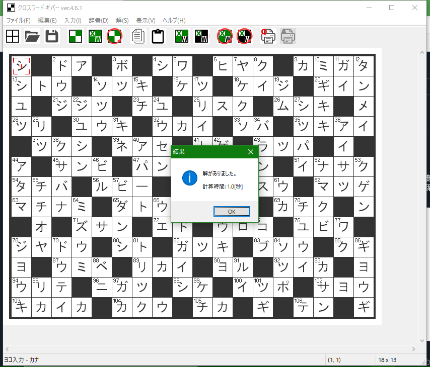

# クロスワード ギバー by 片山博文MZ

## 概要

「クロスワード ギバー」は、クロスワード パズルを自動で作成するソフトです。

Sorry, this software is for Japanese Windows only.

## 使い方

「ファイル」メニューで「問題を自動生成する」を選び、「計算開始」ボタンをクリックすると、問題作成のための計算が始まります。しばらく待つと問題が作成されます。

作った問題は、自分で解いたり、保存したりすることができます。

※発見的な方法で計算しているので時間がかかることがあります。サイズが大きくなるほど、時間が長くかかります。計算中は、気長にお待ち下さい。

- [詳しい使い方](https://katahiromz.web.fc2.com/colony3rd/xwordgiver/)

## 動作環境

- Windows Vista/7/8.1/10。
- Intel Core i5 以上の処理性能。
- マルチコア必須。
- メインメモリー 1GB 以上。
- ストレージ 1GB 以上。

## 使用許諾

「クロスワード ギバー」は、再びフリーソフトになりました。詳しくは、付属のファイルの [LICENSE.txt](LICENSE.txt) をご覧下さい。

## 連絡先

katayama.hirofumi.mz@gmail.com までメールをお送り下さい。

## 技術文書について

ファイル [TechNote.txt](TechNote.txt) に技術的なことが書かれてあります。
